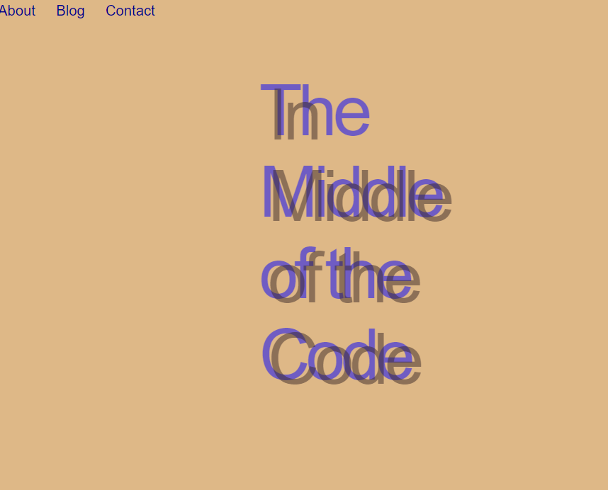
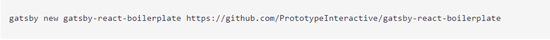
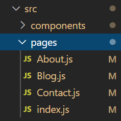

>>>>To create this blog the first step is to install a boilerplate that will provide you all the necessary configuration to get a blank blog. 

>>> 

>>>>You could add different pages to your blog by adding new js file to the folder pages. In the blog I created I included 
>>>>- About: To let people know who I was 
>>>> - Blog:  Where the blog list would be published 
>>>> - Contact : How to get in contact with me 
>>>> - Index: The index page will be your homepage and this the only page that will be present in the pages folder when you build the project 

>>>> 

>>>>After setting up your pages the next step would be to use style the pages. I’ve created a folder component and add the SCSS files for each page.

>>>>You could connect your blog to Contentful or Wordpress. You just have to install the required plugins 

>>>>For this blog simplicity, I’ve decided to go with Markdown. More information can be found: https://www.gatsbyjs.org/docs/adding-markdown-pages/

>>>>Gatsby uses GraphQL to enable page and StaticQuery components to declare what data they and their sub-components need. You do not have to worry about requesting and waiting for data.

>>>>One another advantage of Gatsby, it connects with Netlify which helps with deployment. All you need to do is to set up a Git Hub Repo and you are all set.

>>.
>>.
>>.
>>.
>>.
>>
>>

