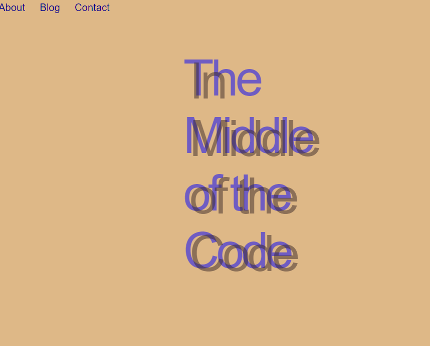
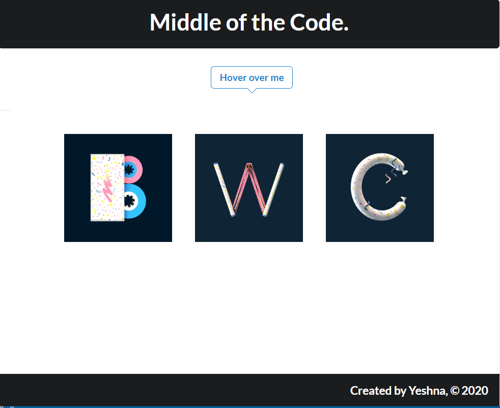
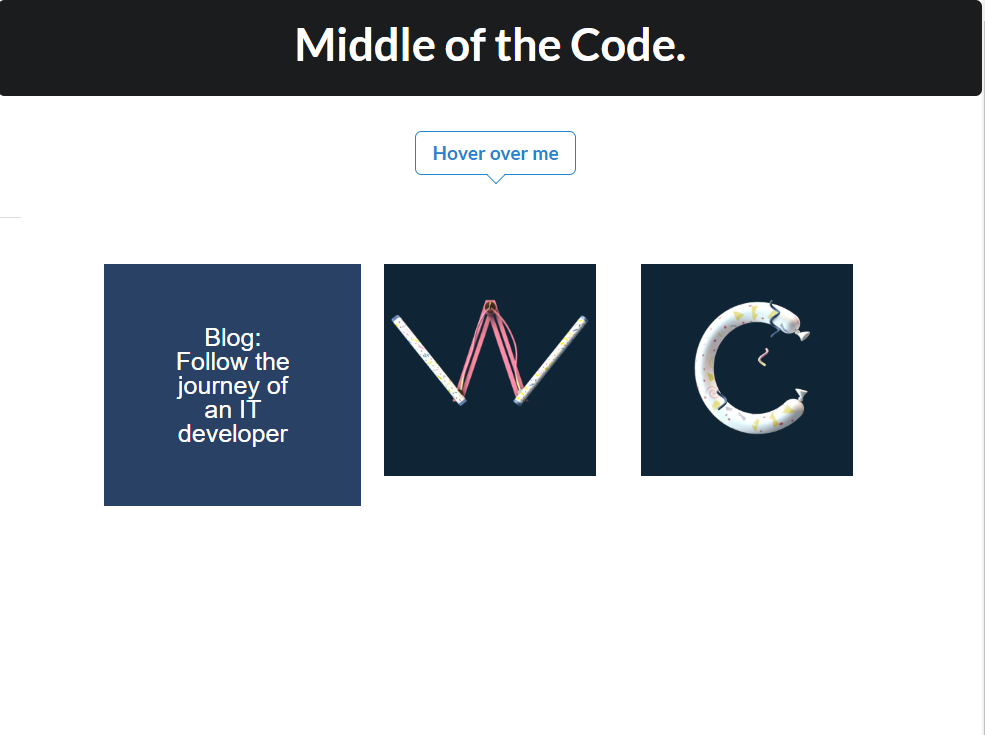
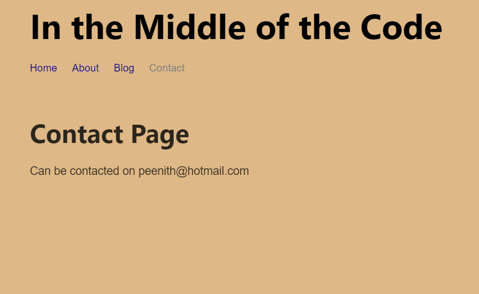
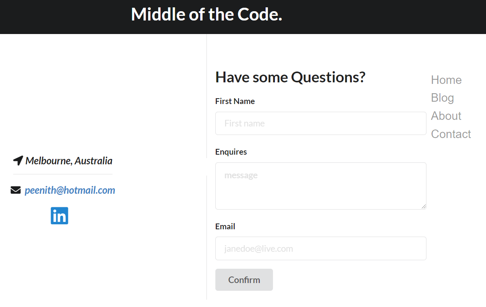
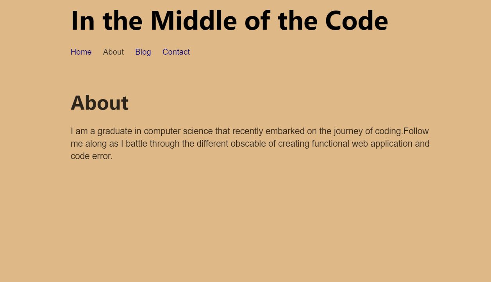
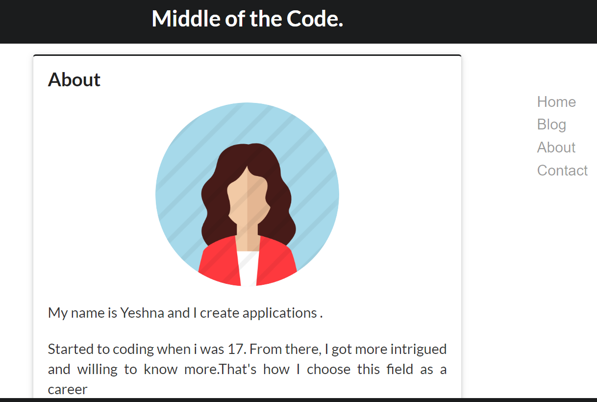
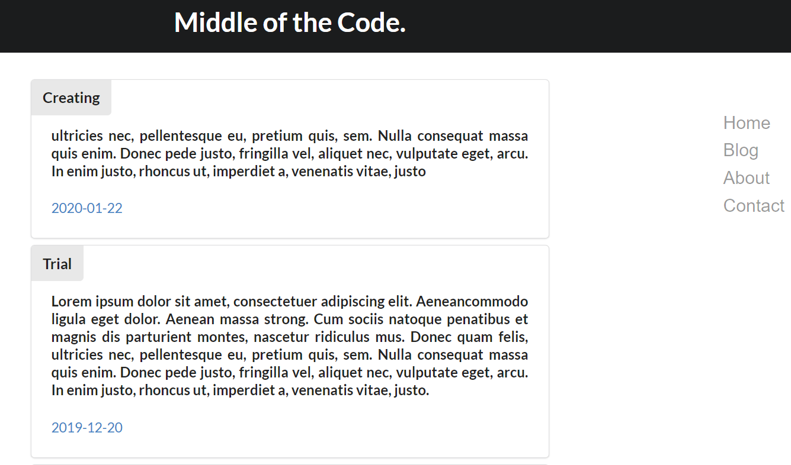

>>>> When I finished my blog using Gatsby js I was left with a simple blog. 
It was functional but it was not visually appealing. To improve how it looked I used 
Semantics UI React library. 
>>>>>>> From  

>>>>>>> To 

>>>>>>> I’ ve changed the header to include the title of the Blog. Instead of using putting 
the navigation bar on top of the page I have included it in the middle of the page. When you 
hover over the of the icons, you discover what was the different pages representing 
such as Blog, About and contact

>>>>Throughout the pages, the header and footer are the same. This can be done by creating a 
layout js file that you add in the styling for the header and footer and include on every page. 

>>>>The next page I worked on was the contact page. Before we had a line saying 
"send you enquires to this email". 

>>>>But now I’ve included a contact form whereby people can submit their queries but also 
can get in touch with me through my email or LinkedIn.

>>>>When it comes to blog designing, I think About pages are not given enough merit as 
it gives an insight into who you are. I scraped off my two-liner About Me and constructed a decent bio 
of who I was and what I do 

>>>>To finish off, on the Blog page, I structured all the posts in the center of the page increase the 
font and including a description of each blog. 

